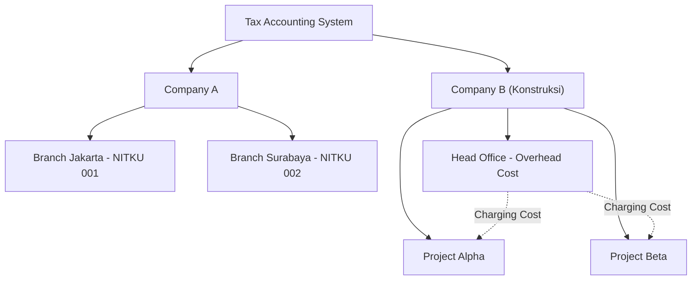
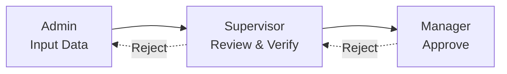
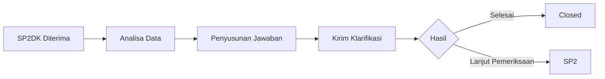
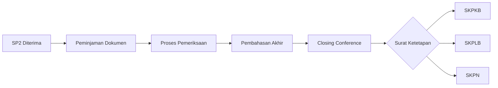
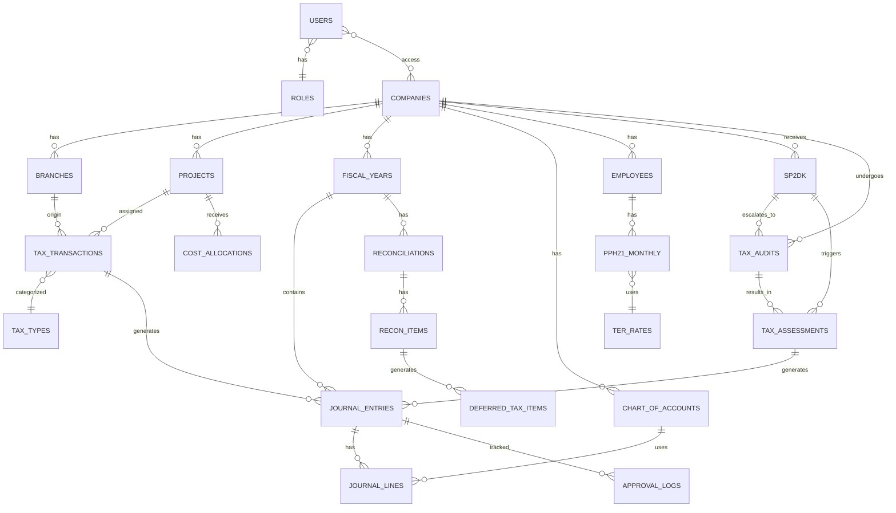

# 📋 PRD — Tax Accounting System v2.2 (Final)

> **Versi**: 2.2 | **Tanggal**: 2 Mei 2026 | **Status**: ✅ APPROVED (2 Mei 2026)

---

## 1. Ringkasan Sistem

Tax Accounting System untuk **multi-company** dengan dukungan **multi-branch** dan **multi-project** (konstruksi). Sistem mencatat transaksi perpajakan dan pembukuan akuntansi, melakukan rekonsiliasi fiskal, menghitung pajak kini & pajak tangguhan (DTA/DTL), dan mengexport data ke format **XML Coretax DJP**.

### Keputusan yang Sudah Dikonfirmasi

| # | Item | Keputusan |
|---|------|-----------|
| 1 | Organisasi | Multi-company + multi-branch + multi-project |
| 2 | Tarif | UU HPP + regulasi terbaru, configurable |
| 3 | Export | XML Coretax DJP (15 template) |
| 4 | Volume | ~700 PM/bln, ~400 bukti potong/bln |
| 5 | Role | Manager, Supervisor, Admin |
| 6 | Bahasa | Bilingual (ID/EN) dengan switcher |
| 7 | Project Cost | Overhead di head office, charging cost ke project |
| 8 | SAP B1 | Integration layer disiapkan, detail menyusul |
| 9 | Approval | Admin input → Supervisor review → Manager approve |

---

## 2. Arsitektur Organisasi



**Aturan:**
- **Company** = 1 entitas hukum, 1 NPWP
- **Branch** = cabang dengan NITKU berbeda, NPWP induk sama
- **Project** = unit laporan untuk konstruksi, konsolidasi ke 1 entitas
- **Overhead Charging** = biaya head office dialokasikan ke project via charging mechanism

---

## 3. Modul Sistem

### 3.1 🏠 Dashboard
- Company/branch/project switcher
- Ringkasan pajak bulan berjalan
- Status rekonsiliasi (selisih pajak vs akuntansi)
- Kalender pajak (jatuh tempo)
- Grafik trend & quick actions

### 3.2 📊 Modul Perpajakan

#### 3.2.1 PPh 21/26 — TER + Progresif

**Bulanan (Jan-Nov):** `PPh 21 = Bruto × Tarif TER`

| Kategori TER | Status PTKP |
|-------------|------------|
| A | TK/0, TK/1, K/0 |
| B | TK/2, K/1, TK/3, K/2 |
| C | K/3 |

**Tahunan (Desember):** Tarif progresif Pasal 17 UU HPP (5%-35%)

**Fitur:** Data karyawan, metode Gross/GrossUp/Nett, bukti potong BPMP/BPA1/BPA2/BP21/BP26

#### 3.2.2 PPh Unifikasi (22, 23/26, 4(2))
- Pencatatan pemotongan/pemungutan
- Bukti potong BPPU, BPNR, BPSP, BPCY, DDBU
- SPT Masa Unifikasi

#### 3.2.3 PPh 25/29
- Angsuran bulanan PPh 25
- Kredit pajak (PPh 21, 22, 23, 24, 25)
- Perhitungan kurang/lebih bayar tahunan

#### 3.2.4 PPN
- Pajak Keluaran (Faktur Pajak) & Pajak Masukan
- Tarif 12% UU HPP, Dok Lain Keluaran/Masukan
- Nota Retur, SPT Masa PPN

### 3.3 📒 Modul Akuntansi
- **COA**: hierarki, per company, akun pajak khusus
- **Journal Entry**: double-entry, auto-journal dari pajak
- **General Ledger**: filter branch/project, drill-down
- **Trial Balance & Laporan Keuangan**
- **Per-Project Reporting** (konstruksi)
- **Overhead Charging**: alokasi biaya HO ke project

### 3.4 🔄 Modul Rekonsiliasi & Pajak Tangguhan

#### Rekonsiliasi Fiskal
- Koreksi beda tetap & beda waktu
- Template koreksi fiskal standar

#### Pajak Kini (Current Tax)
```
Laba Komersial ± Koreksi Fiskal = Laba Fiskal
Laba Fiskal × 22% = Pajak Kini
Pajak Kini - Kredit Pajak = PPh 29 KB/LB
```

#### DTA & DTL (PSAK 46)
```
DTA/DTL = Perbedaan Temporer × Tarif Pajak (22%)
```
- Tracking per item beda waktu
- Auto-journal pajak tangguhan
- Laporan saldo DTA/DTL

### 3.5 📤 Modul Export XML Coretax

> [!IMPORTANT]
> Semua XML schema telah dipelajari dari template resmi DJP. Berikut mapping lengkap:

#### Bupot PPh 21/26 — 5 Template

| Template | Root Element | Item Element | Key Fields |
|----------|-------------|-------------|------------|
| **BPMP** | `MmPayrollBulk` | `MmPayroll` | TIN, TaxPeriod, CounterpartTin, StatusTaxExemption, TaxObjectCode, Gross, Rate, IDPlaceOfBusinessActivity, WithholdingDate |
| **BP21** | `Bp21Bulk` | `Bp21` | + Deemed, Document, DocumentNumber, DocumentDate, IDPlaceOfBusinessActivityOfIncomeRecipient |
| **BP26** | `BP26Bulk` | `BP26` | + CounterpartName/Country/Address/Dob/BirthCity/Passport/Kitas, CounterpartReceiptNumber |
| **BPA1** | `A1Bulk` | `A1` | WorkForSecondEmployer, TaxPeriodMonthStart/End, StatusOfWithholding, SalaryPensionJhtTht, GrossUpOpt, IncomeTaxBenefit, OtherBenefit, Honorarium, InsurancePaidByEmployer, Natura, TantiemBonusThr, PensionContribution, Zakat, Article21IncomeTax |
| **BPA2** | `A2Bulk` | `A2` | + CounterpartNipNrp, CounterpartRank, WifeBenefit, ChildBenefit, IncomeImprovementBenefit, StructuralFunctionalBenefit, RiceBenefit, OtherRegularIncome |

#### Bupot Unifikasi — 5 Template

| Template | Root Element | Item Element | Key Fields |
|----------|-------------|-------------|------------|
| **BPPU** | `BpuBulk` | `Bpu` | TaxBase (bukan Gross), GovTreasurerOpt, SP2DNumber |
| **BPNR** | `BPNRBulk` | `BPNR` | GrossIncome, Deemed, CounterpartName/Country/Address, CounterpartReceiptNumber |
| **BPSP** | `SelfPaymentBulk` | `SelfPayment` | IncomeFromIndonesia/ForeignCountries TaxBase & IncomeTax, Article24CreditedIncomeTax, IncomeTaxWithheldByOtherParty, SelfPaymentIncomeTax |
| **BPCY** | `CYBulk` | `CY` | TaxBase, Rate (digunggung) |
| **DDBU** | `SDocsBulk` | `SDocs` | IncomeRecipientTinNik/Name/AccountId, IncomeGiverTinNik/Name/AccountId, BillingNumber/Date |

#### Faktur PPN — 4 Template

| Template | Root Element | Item Element | Key Fields |
|----------|-------------|-------------|------------|
| **Faktur PK** | `TaxInvoiceBulk` | `TaxInvoice` | TaxInvoiceDate, TaxInvoiceOpt, TrxCode, AddInfo, CustomDoc, FacilityStamp, SellerIDTKU, BuyerTin/Document/Country/Name/Address/Email/IDTKU, ListOfGoodService (Opt, Code, Name, Unit, Price, Qty, TotalDiscount, TaxBase, OtherTaxBase, VATRate, VAT, STLGRate, STLG) |
| **Retur PM** | `InputTaxInvoiceReturn` | `InputReturnData` | TransactionDocumentData (InvoiceNumber, SellerTIN, ReturnDate, ReturnTaxBase/OtherTaxBase/VAT/STLG), TransactionDetailsData Rows (Type, Name, Code, Qty, Unit, UnitPrice, ReturnQty/Discount/TaxBase/VAT/STLG, STLGRate) + FooterRow totals |
| **Dok Lain Keluaran** | `SpecialDocBulk` | `SpecialDoc` | TransactionType, TransactionDetail, TransactionDocument, AdditionalInformation, DocumentNumber/Date, BuyerTIN/Name/Address, TaxBase, VAT, STLG |
| **Dok Lain Masukan** | `InputSpecialDocBulk` | `SpecialDoc` | SpecialDocNo/Date, TrxType/Code/Document, TaxPeriod, TotalTaxBase/VAT/STLG, SellerTin/Name |

### 3.6 🔗 Integration Layer
- API abstraction layer untuk future SAP B1 (Service Layer REST API)
- CSV/Excel import capability
- Mapping configuration (field TAS ↔ external system)
- SAP B1 detail akan dikonfirmasi kemudian

### 3.7 ⚙️ Pengaturan
- Company/branch/project management
- RBAC: Manager (full), Supervisor (approve+edit), Admin (input)
- Bilingual switcher (ID/EN) via i18n JSON
- Tarif pajak configurable per tahun
- Tabel TER PPh 21 configurable
- Audit log semua perubahan

### 3.8 ✅ Approval Workflow



Berlaku untuk: Journal Entry, Bukti Potong, Faktur Pajak, Koreksi Fiskal

### 3.9 🔍 Kontrol Pemeriksaan Pajak & Surat Ketetapan

> [!IMPORTANT]
> Modul ini untuk tracking dan kontrol seluruh proses pemeriksaan pajak, mulai dari SP2DK sampai terbitnya surat ketetapan pajak.

#### 3.9.1 SP2DK (Surat Permintaan Penjelasan Data/Keterangan)



| Fitur | Deskripsi |
|-------|----------|
| Pencatatan SP2DK | Nomor, tanggal terima, jenis pajak, masa/tahun pajak, KPP penerbit |
| Detail Permintaan | Item data yang diminta klarifikasi oleh DJP |
| Deadline Tracking | Jatuh tempo jawaban (14 hari kerja), reminder otomatis |
| Dokumen Jawaban | Upload surat jawaban & dokumen pendukung |
| Lampiran Data | Link ke data transaksi terkait di sistem |
| Status | Draft, Dalam Analisa, Jawaban Terkirim, Closed, Lanjut Pemeriksaan |
| Riwayat | Log semua aktivitas dan korespondensi |

#### 3.9.2 Pemeriksaan Pajak



| Fitur | Deskripsi |
|-------|----------|
| SP2 (Surat Perintah Pemeriksaan) | Nomor, tanggal, tim pemeriksa, jenis pajak, masa/tahun pajak |
| Peminjaman Dokumen | Checklist dokumen yang dipinjam, tanda terima, tracking pengembalian |
| Equalisasi Pemeriksa | Catatan temuan pemeriksa vs data sistem |
| Pembahasan Akhir | Risalah pembahasan, berita acara |
| Closing Conference | Notulen, keputusan, upload dokumen |
| Timeline | Tracking durasi pemeriksaan (maks 12 bulan + perpanjangan) |
| Status | SP2 Diterima, Peminjaman Dokumen, Dalam Pemeriksaan, Pembahasan, Closing, Selesai |

#### 3.9.3 STP (Surat Tagihan Pajak)

| Fitur | Deskripsi |
|-------|----------|
| Pencatatan STP | Nomor, tanggal, jenis pajak, masa/tahun pajak |
| Komponen | Pokok pajak kurang dibayar, sanksi administrasi (bunga/denda) |
| Deadline | Jatuh tempo pembayaran (1 bulan), reminder |
| Status Pembayaran | Belum Bayar, Sebagian Dibayar, Lunas |
| NTPN | Nomor bukti pembayaran |
| Auto-Journal | `Dr. Beban Denda/Bunga Pajak — Cr. Utang STP` |
| Link ke SP2DK | Referensi jika STP timbul dari SP2DK |

#### 3.9.4 SKPKB (Surat Ketetapan Pajak Kurang Bayar)

| Fitur | Deskripsi |
|-------|----------|
| Pencatatan SKPKB | Nomor, tanggal, jenis pajak, masa/tahun pajak |
| Komponen | Pokok pajak kurang bayar + sanksi administrasi |
| Detail Koreksi | Rincian koreksi pemeriksa per item |
| Perbandingan | Data SPT vs Hasil Pemeriksaan (side-by-side) |
| Deadline | Jatuh tempo pembayaran (1 bulan), reminder |
| Upaya Hukum | Tracking keberatan → banding → PK (jika ada) |
| Status | Terbit, Dalam Keberatan, Dalam Banding, Dibayar, Lunas |
| Auto-Journal | `Dr. Beban Pajak Kurang Bayar — Cr. Utang SKPKB` |
| Dampak ke Pajak Tangguhan | Update DTA/DTL jika ada koreksi beda waktu |

#### 3.9.5 SKPLB (Surat Ketetapan Pajak Lebih Bayar)

| Fitur | Deskripsi |
|-------|----------|
| Pencatatan SKPLB | Nomor, tanggal, jenis pajak, masa/tahun pajak |
| Jumlah Lebih Bayar | Nominal restitusi yang disetujui |
| Status Restitusi | Terbit, Proses Pencairan, Dikompensasi, Dicairkan |
| Kompensasi | Jika lebih bayar dikompensasi ke utang pajak lain |
| Timeline | Tracking pencairan (maks 1 bulan setelah terbit) |
| Auto-Journal | `Dr. Piutang Restitusi — Cr. Pajak Dibayar Dimuka` |

#### 3.9.6 SKPN (Surat Ketetapan Pajak Nihil)

| Fitur | Deskripsi |
|-------|----------|
| Pencatatan SKPN | Nomor, tanggal, jenis pajak, masa/tahun pajak |
| Catatan | Tidak ada kurang/lebih bayar |
| Arsip | Upload dokumen SKPN |

#### Dashboard Pemeriksaan & Ketetapan

| Widget | Deskripsi |
|--------|----------|
| SP2DK Aktif | Daftar SP2DK yang belum selesai + countdown deadline |
| Pemeriksaan Berjalan | Status pemeriksaan per company |
| STP/SKPKB Outstanding | Total tagihan belum dibayar |
| Restitusi Pending | SKPLB yang belum dicairkan |
| Timeline History | Riwayat seluruh pemeriksaan & ketetapan per tahun |

---

## 4. Tech Stack

| Layer | Teknologi |
|-------|-----------|
| Backend | PHP (Laravel) |
| Frontend | HTML, CSS, JavaScript |
| Database | MySQL |
| Server | Laragon |
| Charts | Chart.js |
| PDF | DomPDF |
| XML | PHP XMLWriter |
| i18n | Laravel Localization (JSON) |

---

## 5. Database — Key Entities



---

## 6. Fase Development

#### Fase 1 — Foundation
- Laravel setup, DB migration
- Multi-company, branch, project
- Auth + RBAC (Manager, Supervisor, Admin)
- i18n (ID/EN)
- Company setup, fiscal year
- Chart of Accounts + template

#### Fase 2 — Akuntansi Core
- Journal Entry (double-entry, approval workflow)
- General Ledger (filter branch/project)
- Trial Balance
- Laporan Keuangan
- Overhead charging ke project

#### Fase 3 — Perpajakan
- PPh 21 TER (karyawan, perhitungan bulanan+tahunan, bukti potong)
- PPh Unifikasi (23/26, 22, 4(2))
- PPh 25/29 + kredit pajak
- PPN (PM/PK, faktur, SPT Masa)
- Kontrol Pemeriksaan Pajak (SP2DK, SP2, peminjaman dokumen)
- Surat Ketetapan Pajak (STP, SKPKB, SKPLB, SKPN)
- Auto-journal STP & SKPKB

#### Fase 4 — Rekonsiliasi & Pajak Tangguhan
- Rekonsiliasi fiskal (beda tetap & waktu)
- Current Tax + PPh Badan
- DTA/DTL (PSAK 46)
- Kertas kerja rekonsiliasi

#### Fase 5 — Export & Integrasi
- Export XML Coretax (15 template)
- Validasi XML pre-export
- SAP B1 integration layer
- Bulk import CSV/Excel

#### Fase 6 — Dashboard & Polish
- Dashboard visualisasi
- Kalender pajak
- Export PDF/Excel
- Ekualisasi PPN-PPh
- Audit log, testing

---

## 7. Verification Plan

### Automated Tests
- Unit test untuk perhitungan pajak (TER, progresif, PPN)
- Unit test DTA/DTL calculation
- XML validation terhadap sample template
- Double-entry balance validation

### Manual Verification
- Test export XML → import ke Coretax DJP
- Cross-check perhitungan dengan Excel converter DJP
- User acceptance testing oleh tim accounting & tax

---

## 8. Open Items

> [!NOTE]
> Semua pertanyaan utama sudah terjawab. Sisa item pending:

| Item | Status |
|------|--------|
| SAP B1 versi & environment | ⏳ Menunggu konfirmasi |
| Prioritas fase development | ⏳ Ditentukan setelah PRD approved |
| Regulasi tambahan spesifik | 📌 User akan sediakan sumber jika diperlukan |

---

**PRD ini siap untuk di-approve. Setelah approval, kita akan menentukan prioritas fase dan mulai development.**
