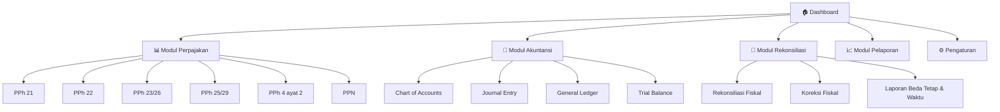
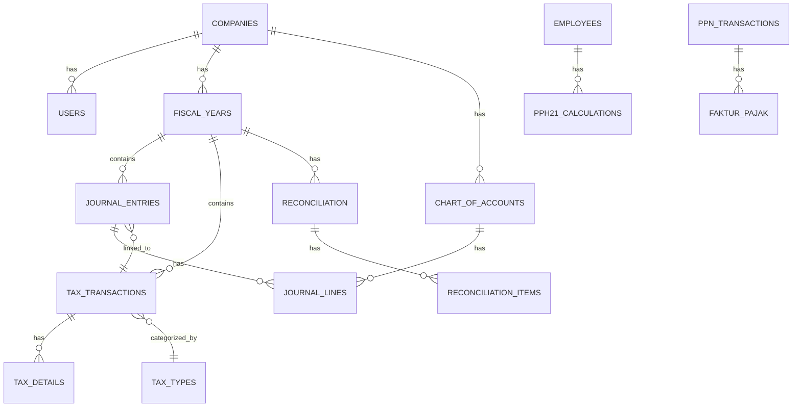

# 📋 Product Requirements Document (PRD)
# Tax Accounting System

> **Versi**: 1.0  
> **Tanggal**: 2 Mei 2026  
> **Status**: Draft — Menunggu Review

---

## 1. Latar Belakang & Tujuan

### 1.1 Latar Belakang
Dalam praktik perpajakan di Indonesia, sering terjadi perbedaan antara pencatatan perpajakan dengan pembukuan akuntansi komersial. Perbedaan ini bisa berupa **beda tetap** (permanent difference) maupun **beda waktu** (temporary difference). Proses rekonsiliasi antara keduanya membutuhkan tools yang dapat:

- Mencatat seluruh transaksi perpajakan secara terstruktur
- Mencatat pembukuan akuntansi komersial
- Melakukan rekonsiliasi fiskal (koreksi fiskal positif & negatif)
- Menghasilkan laporan yang akurat untuk kedua sisi

### 1.2 Tujuan Sistem
1. **Pencatatan Pajak**: Mencatat seluruh jenis transaksi perpajakan (PPh & PPN) secara lengkap
2. **Pembukuan Akuntansi**: Mencatat transaksi akuntansi komersial dengan standar double-entry bookkeeping
3. **Rekonsiliasi Fiskal**: Menyediakan tools untuk membandingkan dan merekonsiliasi data pajak dengan data akuntansi
4. **Pelaporan**: Menghasilkan laporan perpajakan dan akuntansi yang terintegrasi

### 1.3 Target Pengguna
- Tax Consultant / Tax Staff
- Akuntan / Bookkeeper
- Pemilik bisnis (UMKM hingga perusahaan menengah)

---

## 2. Ruang Lingkup Sistem

### 2.1 Modul Utama

---

## 3. Detail Fitur per Modul

### 3.1 🏠 Dashboard

| Fitur | Deskripsi |
|-------|-----------|
| Ringkasan Pajak Bulan Berjalan | Total pajak terutang per jenis pajak |
| Ringkasan Akuntansi | Total pendapatan, beban, laba/rugi berjalan |
| Status Rekonsiliasi | Indikator selisih antara pajak vs akuntansi |
| Kalender Pajak | Reminder jatuh tempo pelaporan & pembayaran |
| Quick Actions | Shortcut untuk transaksi yang sering digunakan |
| Grafik Trend | Visualisasi trend pajak & pendapatan per periode |

---

### 3.2 📊 Modul Perpajakan

#### 3.2.1 PPh Pasal 21 — Pajak Penghasilan Karyawan

| Fitur | Deskripsi |
|-------|-----------|
| Data Karyawan | Nama, NPWP, status PTKP (TK/0, K/0, K/1, K/2, K/3) |
| Perhitungan PPh 21 | Perhitungan otomatis berdasarkan tarif progresif Pasal 17 |
| Metode Pemotongan | Gross, Gross-Up, Nett |
| Input Penghasilan | Gaji pokok, tunjangan, bonus, THR, lembur |
| Pengurang | Biaya jabatan, iuran pensiun, iuran JHT |
| SPT Masa PPh 21 | Generate data untuk SPT Masa PPh 21 |
| Bukti Potong | Generate 1721-A1 (karyawan tetap), 1721-VI (tidak tetap) |

**Tarif PPh 21 (UU HPP):**

| Lapisan | Penghasilan Kena Pajak (PKP) | Tarif |
|---------|------------------------------|-------|
| 1 | s.d. Rp 60.000.000 | 5% |
| 2 | > Rp 60.000.000 — Rp 250.000.000 | 15% |
| 3 | > Rp 250.000.000 — Rp 500.000.000 | 25% |
| 4 | > Rp 500.000.000 — Rp 5.000.000.000 | 30% |
| 5 | > Rp 5.000.000.000 | 35% |

#### 3.2.2 PPh Pasal 22 — Pajak atas Pembelian/Impor

| Fitur | Deskripsi |
|-------|-----------|
| Pencatatan Transaksi | Nilai impor/pembelian, tarif, pajak terutang |
| Jenis Transaksi | Impor barang, pembelian dari bendaharawan, industri tertentu |
| Bukti Pungut | Generate bukti pemungutan PPh 22 |
| Kredit Pajak | Tracking PPh 22 sebagai kredit pajak |

#### 3.2.3 PPh Pasal 23/26 — Pajak atas Jasa & Dividen

| Fitur | Deskripsi |
|-------|-----------|
| Pencatatan Pemotongan | DPP, tarif, PPh terutang |
| Jenis Penghasilan | Dividen, bunga, royalti, sewa, jasa teknik, jasa manajemen, jasa konsultan, dll. |
| Tarif Standar | 15% (dividen, bunga, royalti) dan 2% (jasa) |
| PPh 26 | Untuk subjek pajak luar negeri (tarif 20% atau sesuai P3B) |
| Bukti Potong | Generate bukti potong PPh 23/26 |
| SPT Masa PPh 23/26 | Data untuk pelaporan masa |

#### 3.2.4 PPh Pasal 25/29 — Angsuran & Tahunan

| Fitur | Deskripsi |
|-------|-----------|
| PPh 25 Bulanan | Perhitungan angsuran PPh bulanan |
| PPh 29 | Perhitungan kurang/lebih bayar tahunan |
| Kredit Pajak | Kompilasi seluruh kredit pajak (PPh 21, 22, 23, 25) |
| Kompensasi Kerugian | Tracking kerugian fiskal yang bisa dikompensasi (max 5 tahun) |

#### 3.2.5 PPh Pasal 4 Ayat 2 — Pajak Final

| Fitur | Deskripsi |
|-------|-----------|
| Jenis Penghasilan | Sewa tanah/bangunan, jasa konstruksi, bunga deposito, hadiah undian, UMKM |
| Tarif | Sesuai PP masing-masing jenis (10% sewa, 0.5% UMKM, dll.) |
| Pencatatan | DPP, tarif, PPh terutang, tanggal potong/setor |
| Bukti Potong | Generate bukti potong PPh 4(2) |

#### 3.2.6 PPN — Pajak Pertambahan Nilai

| Fitur | Deskripsi |
|-------|-----------|
| Pajak Keluaran | Pencatatan PPN atas penjualan (Faktur Pajak Keluaran) |
| Pajak Masukan | Pencatatan PPN atas pembelian (Faktur Pajak Masukan) |
| Tarif PPN | 12% (sesuai UU HPP berlaku 2025) |
| Perhitungan PPN | PPN Keluaran - PPN Masukan = Kurang/Lebih Bayar |
| Faktur Pajak | Pencatatan nomor faktur, NPWP lawan transaksi, DPP |
| SPT Masa PPN | Data untuk SPT Masa PPN (Form 1111) |
| Retur | Pencatatan nota retur pajak masukan/keluaran |

---

### 3.3 📒 Modul Akuntansi

#### 3.3.1 Chart of Accounts (Bagan Akun)

| Fitur | Deskripsi |
|-------|-----------|
| Template COA | Bagan akun standar yang bisa dikustomisasi |
| Hierarki Akun | Parent-child relationship antar akun |
| Klasifikasi | Aset, Liabilitas, Ekuitas, Pendapatan, Beban |
| Akun Pajak | Akun khusus untuk pencatatan pajak (Hutang PPh 21, PPN Masukan, dll.) |
| Status Akun | Aktif / Non-aktif |

**Struktur Kode Akun:**

| Kode | Klasifikasi |
|------|-------------|
| 1xxx | Aset |
| 2xxx | Liabilitas |
| 3xxx | Ekuitas |
| 4xxx | Pendapatan |
| 5xxx | Harga Pokok Penjualan |
| 6xxx | Beban Operasional |
| 7xxx | Pendapatan/Beban Lain-lain |
| 8xxx | Akun Pajak |

#### 3.3.2 Journal Entry (Jurnal)

| Fitur | Deskripsi |
|-------|-----------|
| Double-Entry | Setiap jurnal harus balance (Debit = Kredit) |
| Jenis Jurnal | Jurnal Umum, Jurnal Penyesuaian, Jurnal Penutup |
| Auto-Journal | Jurnal otomatis saat input transaksi pajak |
| Nomor Referensi | Penomoran otomatis per jenis jurnal |
| Lampiran | Upload dokumen pendukung (invoice, faktur, dll.) |
| Approval | Workflow approval untuk jurnal tertentu (opsional) |

#### 3.3.3 General Ledger (Buku Besar)

| Fitur | Deskripsi |
|-------|-----------|
| Buku Besar per Akun | Detail transaksi per akun dengan saldo berjalan |
| Filter Periode | View per bulan, kuartal, atau tahun |
| Drill-Down | Dari buku besar bisa klik ke detail jurnal |
| Export | Export ke Excel/PDF |

#### 3.3.4 Trial Balance (Neraca Saldo)

| Fitur | Deskripsi |
|-------|-----------|
| Neraca Saldo | Daftar saldo semua akun pada periode tertentu |
| Adjusted Trial Balance | Setelah jurnal penyesuaian |
| Validasi | Warning jika Debit ≠ Kredit |

---

### 3.4 🔄 Modul Rekonsiliasi Fiskal

> [!IMPORTANT]
> Ini adalah **fitur inti** yang membedakan sistem ini dari software akuntansi biasa. Modul ini menjembatani perbedaan antara laba komersial (akuntansi) dan laba fiskal (perpajakan).

#### 3.4.1 Rekonsiliasi Fiskal

| Fitur | Deskripsi |
|-------|-----------|
| Laba Komersial | Ambil dari laporan laba rugi akuntansi |
| Koreksi Fiskal Positif | Beban yang tidak diakui pajak (sumbangan, entertainment tanpa daftar nominatif, denda pajak, PPh yang ditanggung perusahaan, dll.) |
| Koreksi Fiskal Negatif | Pendapatan yang sudah dipotong final, pendapatan bukan objek pajak |
| Laba Fiskal | Hasil setelah koreksi = dasar perhitungan PPh Badan |
| Template Koreksi | Daftar item koreksi fiskal yang umum |

#### 3.4.2 Jenis Koreksi Fiskal

**Beda Tetap (Permanent Difference):**

| Item | Jenis Koreksi | Keterangan |
|------|---------------|------------|
| Sumbangan/donasi | Positif | Tidak diakui sebagai pengurang |
| Entertainment tanpa nominatif | Positif | Tidak memenuhi syarat formal |
| Denda pajak | Positif | Non-deductible |
| PPh ditanggung perusahaan | Positif | Non-deductible |
| Natura yang bukan objek | Positif | Sesuai ketentuan |
| Pendapatan bunga deposito | Negatif | Sudah dipotong PPh Final |
| Pendapatan sewa (final) | Negatif | Sudah dipotong PPh Final |
| Dividen dari dalam negeri | Negatif | Bukan objek pajak (UU HPP) |

**Beda Waktu (Temporary Difference):**

| Item | Jenis Koreksi | Keterangan |
|------|---------------|------------|
| Penyusutan fiskal vs komersial | Positif/Negatif | Metode & masa manfaat berbeda |
| Amortisasi fiskal vs komersial | Positif/Negatif | Metode & masa manfaat berbeda |
| Penyisihan piutang tak tertagih | Positif | Pajak: harus memenuhi syarat tertentu |
| Cadangan imbalan kerja | Positif | Pajak: diakui saat dibayar |

#### 3.4.3 Laporan Rekonsiliasi

| Fitur | Deskripsi |
|-------|-----------|
| Kertas Kerja Rekonsiliasi | Format standar rekonsiliasi fiskal |
| Perbandingan Side-by-Side | Komersial vs Fiskal per akun |
| Summary Koreksi | Ringkasan total koreksi positif & negatif |
| Perhitungan PPh Badan | Dari laba fiskal ke PPh Badan terutang |
| Historical Comparison | Perbandingan rekonsiliasi antar tahun |

---

### 3.5 📈 Modul Pelaporan

#### Laporan Perpajakan

| Laporan | Deskripsi |
|---------|-----------|
| Rekap PPh per Jenis | Ringkasan PPh 21, 22, 23, 25, 4(2) per periode |
| Rekap PPN | Ringkasan PPN Keluaran vs Masukan per masa |
| Daftar Bukti Potong | Seluruh bukti potong yang diterbitkan/diterima |
| Kredit Pajak | Kompilasi kredit pajak untuk SPT Tahunan |
| Ekualisasi PPN-PPh | Perbandingan omzet di PPN vs PPh |

#### Laporan Akuntansi

| Laporan | Deskripsi |
|---------|-----------|
| Laporan Laba Rugi | Income Statement (komersial) |
| Neraca | Balance Sheet |
| Laporan Arus Kas | Cash Flow Statement |
| Laporan Perubahan Ekuitas | Statement of Changes in Equity |

#### Laporan Rekonsiliasi

| Laporan | Deskripsi |
|---------|-----------|
| Laporan Rekonsiliasi Fiskal | Dari laba komersial ke laba fiskal |
| Laporan Beda Tetap & Waktu | Detail per item koreksi |
| Perhitungan PPh Badan | SPT 1771 worksheet |

---

### 3.6 ⚙️ Pengaturan

| Fitur | Deskripsi |
|-------|-----------|
| Profil Perusahaan | Nama, NPWP, alamat, jenis usaha, KLU |
| Tahun Buku | Periode tahun buku (Januari-Desember atau custom) |
| Mata Uang | Default IDR, support multi-currency |
| Tarif Pajak | Konfigurasi tarif pajak yang berlaku |
| User Management | Multi-user dengan role (Admin, Tax Staff, Accountant, Viewer) |
| Backup & Restore | Backup database secara berkala |
| Audit Log | Logging semua perubahan data |

---

## 4. Non-Functional Requirements

### 4.1 Keamanan
- Autentikasi berbasis username/password
- Role-Based Access Control (RBAC)
- Audit trail untuk semua perubahan data
- Enkripsi data sensitif (NPWP, data karyawan)

### 4.2 Performa
- Halaman load < 2 detik
- Support data hingga 100.000 transaksi per tahun
- Export laporan PDF/Excel dalam < 10 detik

### 4.3 Usability
- Responsive design (desktop & tablet)
- Bahasa Indonesia sebagai bahasa utama
- Inline help & tooltips untuk istilah perpajakan
- Keyboard shortcuts untuk power users

---

## 5. Rencana Teknis

### 5.1 Technology Stack

| Layer | Teknologi |
|-------|-----------|
| **Frontend** | HTML, CSS, JavaScript (Vanilla) |
| **Backend** | PHP (Laravel Framework) |
| **Database** | MySQL |
| **Server** | Laragon (Local Development) |
| **Reporting** | HTML-to-PDF generation |
| **Charts** | Chart.js untuk visualisasi |

> [!NOTE]
> Stack dipilih berdasarkan environment user yang sudah menggunakan **Laragon** (PHP + MySQL ready). Laravel menyediakan ORM, migration, authentication, dan middleware yang mempercepat development.

### 5.2 Arsitektur Database (High-Level)

### 5.3 Fase Development

#### Fase 1 — Foundation (Sprint 1-2)
- [x] PRD & Planning
- [ ] Setup project Laravel
- [ ] Database migration & seeding
- [ ] Authentication & User Management
- [ ] Company Setup & Fiscal Year
- [ ] Chart of Accounts (CRUD + Template)

#### Fase 2 — Akuntansi Core (Sprint 3-4)
- [ ] Journal Entry (Create, Edit, Delete, Approve)
- [ ] General Ledger
- [ ] Trial Balance
- [ ] Laporan Keuangan (Laba Rugi, Neraca)

#### Fase 3 — Perpajakan (Sprint 5-7)
- [ ] PPh 21 (Data Karyawan, Perhitungan, Bukti Potong)
- [ ] PPh 23/26 (Pencatatan, Bukti Potong)
- [ ] PPh 4(2) (Pencatatan, Bukti Potong)
- [ ] PPh 22 (Pencatatan)
- [ ] PPh 25/29 (Angsuran, Kredit Pajak)
- [ ] PPN (Pajak Masukan, Pajak Keluaran, SPT Masa)

#### Fase 4 — Rekonsiliasi (Sprint 8-9)
- [ ] Rekonsiliasi Fiskal
- [ ] Koreksi Fiskal (Beda Tetap & Beda Waktu)
- [ ] Perhitungan PPh Badan
- [ ] Ekualisasi PPN-PPh

#### Fase 5 — Dashboard & Polish (Sprint 10)
- [ ] Dashboard dengan visualisasi
- [ ] Kalender Pajak
- [ ] Export PDF/Excel
- [ ] Audit Log
- [ ] Testing & Bug Fixing

---

## 6. User Review Required

> [!IMPORTANT]
> **Beberapa hal yang perlu konfirmasi sebelum mulai development:**

### Pertanyaan untuk User

1. **Jenis Entitas**: Apakah sistem ini untuk **satu perusahaan** saja atau perlu support **multi-company** (misalnya untuk konsultan pajak yang handle banyak klien)?

2. **Tarif Pajak**: Apakah menggunakan tarif terbaru UU HPP (PPh Badan 22%, PPN 12%) atau perlu support tarif historis juga?

3. **Integrasi e-SPT/Coretax**: Apakah perlu fitur export data ke format yang compatible dengan aplikasi e-SPT DJP atau Coretax? Atau cukup sebagai internal tools?

4. **Skala Data**: Berapa perkiraan jumlah transaksi per bulan? Ini akan mempengaruhi desain database dan performa.

5. **Multi-User**: Apakah perlu fitur multi-user dengan role berbeda, atau cukup single-user?

6. **Bahasa**: Apakah interface seluruhnya dalam **Bahasa Indonesia**, atau perlu bilingual (Indonesia + English)?

7. **Fase Prioritas**: Dari 5 fase di atas, apakah ada modul yang ingin diprioritaskan terlebih dahulu? Misalnya jika PPN lebih urgent, kita bisa mulai dari situ.

8. **Existing Data**: Apakah ada data existing yang perlu dimigrasi ke sistem baru ini?

---

## 7. Risiko & Mitigasi

| Risiko | Dampak | Mitigasi |
|--------|--------|----------|
| Perubahan regulasi pajak | Perhitungan jadi salah | Tarif & rules dikonfigurasi di database, bukan hardcode |
| Data integrity issue | Laporan tidak akurat | Double-entry validation, audit trail |
| Kompleksitas rekonsiliasi | Development lambat | Mulai dari template koreksi fiskal yang umum |
| User adoption | Sistem tidak dipakai | UI intuitif, inline help, bahasa Indonesia |
